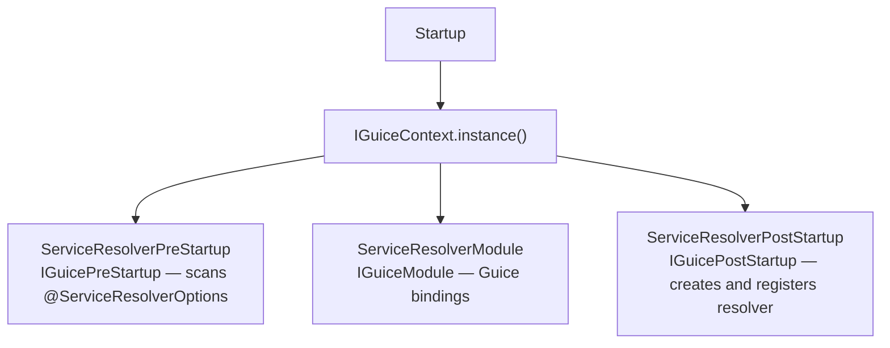
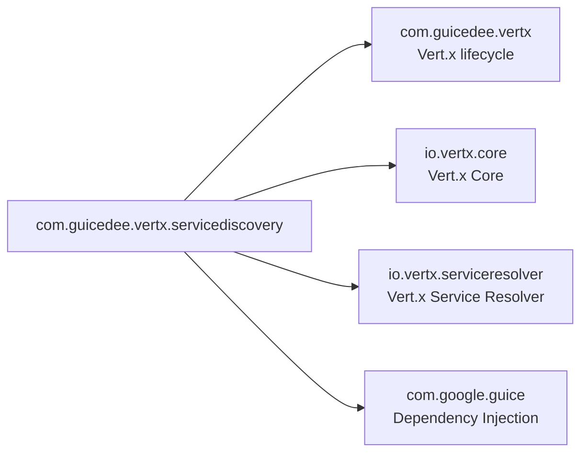

# GuicedEE Vert.x Service Discovery

[](https://github.com/GuicedEE/GuicedVertxServiceDiscovery/actions/workflows/build.yml)
[](https://github.com/GuicedEE/GuicedVertxServiceDiscovery)
[](https://www.apache.org/licenses/LICENSE-2.0)


Integrates the **Vert.x Service Resolver** into the GuicedEE lifecycle, providing client-side service discovery via Kubernetes endpoints or DNS SRV records with built-in load balancing.

Built on [Vert.x 5](https://vertx.io/) · [Vert.x Service Resolver](https://vertx.io/docs/vertx-service-resolver/java/) · [Google Guice](https://github.com/google/guice) · JPMS module `com.guicedee.vertx.servicediscovery` · Java 25+

## 📦 Installation

```xml
<dependency>
  <groupId>com.guicedee</groupId>
  <artifactId>service-discovery</artifactId>
</dependency>
```

<details>
<summary>Gradle (Kotlin DSL)</summary>

```kotlin
implementation("com.guicedee:service-discovery:2.1.0-SNAPSHOT")
```
</details>

## ✨ Features

- **Kubernetes service resolution** — resolves services via Kubernetes endpoints API
- **DNS SRV resolution** — resolves services via DNS SRV records
- **Pluggable providers** — `IServiceResolverProvider` SPI for custom resolver backends (e.g. Consul)
- **Environment-driven configuration** — resolver type and connection details via environment variables
- **Load balancing** — built-in round-robin across healthy instances
- **Guice-managed lifecycle** — automatic startup/shutdown via `IGuicePostStartup` / `IGuicePreDestroy`

## 🚀 Quick Start

**Step 1** — Add a `package-info.java` in your service client package:

```java
@ServiceResolverOptions(value = "my-services", type = "kubernetes",
    kubeNamespace = "production", kubeTrustAll = false)
package com.myapp.clients;

import com.guicedee.vertx.servicediscovery.ServiceResolverOptions;
```

**Step 2** — Resolve and call services:

```java
AddressResolver<ServiceAddress> resolver = ServiceResolverRegistry.resolveForClass(MyServiceClient.class);

HttpClient client = vertx.httpClientBuilder()
    .withAddressResolver(resolver)
    .build();

ServiceAddress serviceAddress = ServiceAddress.of("my-service");
client.request(new RequestOptions()
    .setMethod(HttpMethod.GET)
    .setURI("/api/data")
    .setServer(serviceAddress))
    .compose(req -> req.send())
    .compose(resp -> resp.body())
    .onSuccess(body -> System.out.println(body));
```

**Step 3** — Override via environment variables (no code change needed):

```bash
export SERVICE_RESOLVER_MY_SERVICES_KUBE_HOST=10.0.0.1
export SERVICE_RESOLVER_MY_SERVICES_KUBE_PORT=443
export SERVICE_RESOLVER_MY_SERVICES_KUBE_NAMESPACE=staging
export SERVICE_RESOLVER_MY_SERVICES_KUBE_TRUST_ALL=true
export SERVICE_RESOLVER_MY_SERVICES_KUBE_BEARER_TOKEN=eyJ...
```

## 📐 Architecture



## ⚙️ Configuration

All attributes support environment variable override using the pattern `SERVICE_RESOLVER_{NAME}_{PROPERTY}`:

| Variable Pattern | Default | Purpose |
|---|---|---|
| `SERVICE_RESOLVER_{NAME}_TYPE` | `"auto"` | Resolver type: `kubernetes`, `kube`, `srv`, `dns`, `auto`, or custom SPI |
| `SERVICE_RESOLVER_{NAME}_KUBE_HOST` | (from pod env) | Kubernetes API server host |
| `SERVICE_RESOLVER_{NAME}_KUBE_PORT` | `443` | Kubernetes API server port |
| `SERVICE_RESOLVER_{NAME}_KUBE_NAMESPACE` | (from pod env) | Kubernetes namespace for service resolution |
| `SERVICE_RESOLVER_{NAME}_KUBE_TRUST_ALL` | `false` | Trust all SSL certificates (useful for dev clusters) |
| `SERVICE_RESOLVER_{NAME}_KUBE_BEARER_TOKEN` | (from pod env) | Bearer token for K8s API authentication |
| `SERVICE_RESOLVER_{NAME}_SRV_HOST` | (system default) | DNS server for SRV resolution |
| `SERVICE_RESOLVER_{NAME}_SRV_PORT` | `53` | DNS server port |
| `SERVICE_RESOLVER_{NAME}_LOAD_BALANCER` | `round_robin` | Load balancer strategy |

Global fallback (without name): `SERVICE_RESOLVER_{PROPERTY}` (e.g. `SERVICE_RESOLVER_LOAD_BALANCER`).

## 🔌 SPI & Extension Points

| SPI | When it runs | Purpose |
|---|---|---|
| `IServiceResolverProvider` | During resolver creation | Pluggable resolver backend (e.g. Consul) |
| `ServiceResolverOptionsConfigurator` | Before resolver created | Configure resolver-specific options |
| `ServiceResolverConfigurator` | After resolver created | Customize the resolver instance |

### Custom Resolver Provider

Implement `IServiceResolverProvider` to add support for a new resolver backend:

```java
public class ConsulResolverProvider implements IServiceResolverProvider<ConsulResolverProvider> {
    @Override
    public String type() {
        return "consul";
    }

    @Override
    public AddressResolver<ServiceAddress> create(String name, ServiceResolverOptions options) {
        // build and return your resolver using options.consulHost(), options.consulPort(), etc.
    }
}
```

Register via JPMS:

```java
module my.app {
    provides com.guicedee.vertx.servicediscovery.IServiceResolverProvider
        with my.app.MyResolverProvider;
}
```

## 🗺️ Module Graph



## 🧩 JPMS

Module name: **`com.guicedee.vertx.servicediscovery`**

The module:
- **exports** `com.guicedee.vertx.servicediscovery`
- **provides** `IGuicePreStartup` with `ServiceResolverPreStartup`, `IGuicePostStartup` with `ServiceResolverPostStartup`, `IGuiceModule` with `ServiceResolverModule`
- **uses** `IServiceResolverProvider`

```java
module my.app {
    requires com.guicedee.vertx.servicediscovery;

    // Optional: provide SPI implementations
    provides com.guicedee.vertx.servicediscovery.IServiceResolverProvider
        with my.app.MyResolverProvider;
}
```

## 🏗️ Key Classes

| Class | Package | Role |
|---|---|---|
| `ServiceResolverOptions` | `servicediscovery` | Annotation for configuring resolver type, host, port, namespace, trustAll |
| `ServiceResolverRegistry` | `servicediscovery` | Registry of configured resolver instances — `getResolver()`, `resolveForClass()` |
| `IServiceResolverProvider` | `servicediscovery` | SPI for pluggable resolver backends (Consul, Eureka, etc.) |
| `ServiceResolverPreStartup` | `implementations` | Scans `@ServiceResolverOptions` annotations and resolves env var overrides |
| `ServiceResolverPostStartup` | `implementations` | Creates all resolver instances after Vert.x is ready |

## 🤝 Integration with Other Modules

### runtime-autoconfigure (optional)

When `com.guicedee:runtime-autoconfigure` is on the classpath and type is `"auto"`:

```java
@AzureContainerApps
@ServiceResolverOptions(value = "services", type = "auto")
package com.myapp;
```

The auto resolver detects `KUBERNETES_SERVICE_HOST` (set by Azure/ECS/GKE) and creates a `KubeResolver` automatically.

### telemetry (optional)

When `com.guicedee:telemetry` is on the classpath, all service resolution activity is traced with OpenTelemetry resource attributes:

- `service.name` — from `RuntimeEnvironment.serviceName()`
- `cloud.provider` — `azure-container-apps`, `aws-ecs`, etc.
- `cloud.region` — from `RuntimeEnvironment.region()`
- `service.instance.id` — from `RuntimeEnvironment.serviceId()`

## 🤝 Contributing

Issues and pull requests are welcome — please add tests for new resolver providers or configuration features.

## 📄 License

[Apache 2.0](https://www.apache.org/licenses/LICENSE-2.0)
